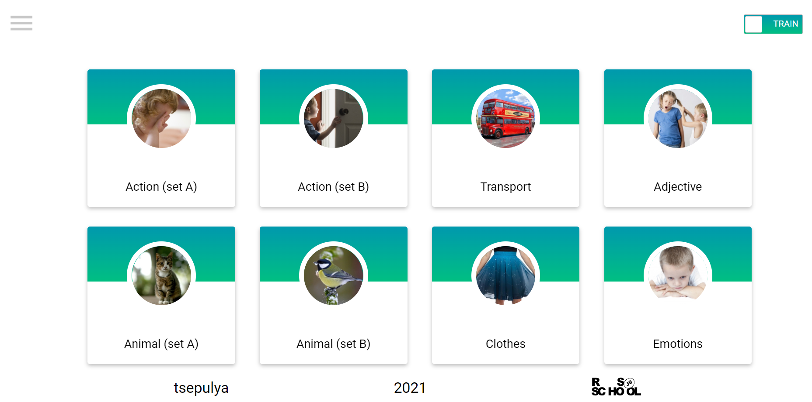

# English for kids
Learning of English for kids in train/play mode

## Deploy

[Demo English for kids](https://tsepulya-efk.netlify.app/)



## Description

Its` an application, that helps to learn and memorize new words in English

## How to use

You have two modes - 'PLAY' and 'TRAIN'.
'TRAIN' - if you want to learn new words.
'PLAY' - if you want to check yourself.

At the main page you can choose a category.
At the page of certain category you can click on card and listen the pronunciation or see the translation.
Also you can see your own statistics and repeat difficult words on the page 'Statistics.

## Installation

$ npm install
```

## Running the app


